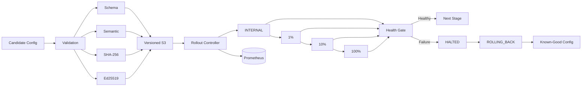

# Blast-Radius Guard

> **Safe configuration delivery for distributed Kubernetes systems.**

Blast-Radius Guard is a **production-style DevOps engineering project** that prevents unsafe configuration changes from propagating across every deployment cell at once.

It combines **schema + semantic validation, SHA-256 integrity verification, Ed25519 signing, staged promotion, health gates, Prometheus observability, versioned S3 artifacts, and automatic cross-cell rollback** into one reproducible rollout workflow.

<p align="left">
  <a href="https://github.com/gauravghodevs/k8s-config-consumer/actions/workflows/ci.yml">
    
  </a>
  
  
  
  
  
</p>

---

## The Problem

A configuration can be **syntactically valid and still be operationally dangerous**.

A traditional deployment flow may look like:

```text
Configuration Change
        ↓
Deploy Everywhere
        ↓
Discover Failure
        ↓
Recover Under Pressure
```

Blast-Radius Guard changes the release model:

```text
Validate
   ↓
Verify Integrity
   ↓
Verify Signature
   ↓
Promote Small
   ↓
Observe + Bake
   ↓
Promote Further
   ↓
Healthy → Continue
Failure → HALT → ROLLBACK
```

### Design principle

> **Reduce blast radius before increasing exposure.**

---

## Architecture



### Kubernetes cell model

```text
                    Rollout Controller
                           │
             ┌─────────────┼─────────────┐
             ▼             ▼             ▼
       blast-cell-1  blast-cell-2  blast-cell-3
             │             │             │
             ▼             ▼             ▼
        rules-consumer rules-consumer rules-consumer
```

The rollout percentages are **logical stages in the local simulation**, not actual load-balancer traffic percentages.

---

## Rollout Flow

```text
PENDING
   │
   ▼
VALIDATING
   │
   ├── Schema
   ├── Semantic rules
   ├── Size limit
   ├── SHA-256
   └── Ed25519 signature
   │
   ▼
PROMOTING
   │
   ▼
BAKING
   │
   ├── Readiness
   ├── Health
   ├── Active configuration
   └── Prometheus signals
   │
   ├───────────────┐
   ▼               ▼
HEALTHY          HALTED
   │               │
   ▼               ▼
NEXT STAGE     ROLLING_BACK
                   │
                   ▼
             KNOWN-GOOD CONFIG
```

A failed stage does **not** continue to later cells.

---

## Deployment Controls

| Control | Purpose |
|---|---|
| JSON Schema | Reject malformed configuration structure |
| Semantic validation | Reject unsafe values and rule combinations |
| Duplicate detection | Prevent conflicting duplicate rules |
| Dangerous-name checks | Reject unsafe rule names |
| Priority validation | Enforce valid rule priority |
| 1 MiB size guard | Prevent oversized candidates |
| SHA-256 | Verify exact candidate bytes |
| Ed25519 | Cryptographically authenticate candidates |
| Health gates | Prevent unhealthy promotion |
| Bake periods | Observe before increasing exposure |
| Last-known-good | Preserve a working configuration |
| Cross-cell rollback | Restore previously promoted cells |
| Durable state | Recover rollout state after controller restart |

---

## Configuration Integrity

### Ed25519 signing

The controller can require a detached Ed25519 signature for every candidate.

```text
candidate.yaml
      +
candidate.yaml.sig
      ↓
Public-key verification
      ↓
Accepted / Rejected
```

Private signing keys are **never committed to Git**.

Signature enforcement:

```bash
REQUIRE_SIGNATURE=true \
controller/.venv/bin/python -m controller.rollout_guard \
config/candidate-v1.4.yaml
```

A candidate modified after signing fails verification before promotion.

### SHA-256 integrity

The controller hashes the **exact candidate bytes** and compares the stored artifact against that expected digest.

This protects the boundary between validation and artifact storage.

---

## AWS / Terraform

The project integrates versioned S3 storage for validated configuration artifacts.

Terraform provisions:

- S3 bucket
- Versioning
- Server-side encryption
- Public-access blocking
- Object ownership controls
- Lifecycle configuration
- Least-privilege IAM policy

The controller requires only the S3 operations it needs, including:

```text
s3:GetObject
s3:PutObject
s3:ListBucket
```

Terraform state and sensitive variable files are excluded from Git.

---

## Observability

The consumer exposes Prometheus-compatible metrics through:

```text
/metrics
```

### Consumer metrics

```text
rules_config_loaded
rules_config_version
rules_config_reload_success_total
rules_config_reload_failure_total
rules_config_last_reload_timestamp
```

### Controller metrics

```text
blast_radius_rollouts_total
blast_radius_rollouts_success_total
blast_radius_rollouts_halted_total
blast_radius_rollbacks_total
blast_radius_signature_failures_total
blast_radius_rollout_duration_seconds
```

Prometheus is configured to scrape all three simulated Kubernetes cells.

---

## Failure Handling

The project includes **deterministic runtime failure injection** so the safety path can be tested repeatedly.

```bash
INJECT_RUNTIME_FAILURE=true \
BAKE_INTERNAL=5 \
BAKE_1_PERCENT=5 \
BAKE_10_PERCENT=5 \
controller/.venv/bin/python -m controller.rollout_guard \
config/candidate-v1.5-runtime-test.yaml
```

Expected safety behavior:

```text
Candidate
   ↓
Promotion
   ↓
Bake
   ↓
Failure detected
   ↓
HALTED
   ↓
ROLLING_BACK
   ↓
Previous known-good configuration
   ↓
Integrity verified
```

The rollback path is deliberately reproducible rather than relying on an accidental failure.

---

## Verification

The latest verified regression run:

```text
31 passed
```

Run the complete suite:

```bash
controller/.venv/bin/pytest -q
```

The automated tests cover:

- Configuration validation
- Consumer behavior
- Controller behavior
- Ed25519 signing
- Signature enforcement
- S3 storage
- Durable state recovery
- Prometheus observability
- Consumer contract behavior
- Configuration-size protection
- CI failure handling
- Kubernetes deployment readiness

### CI pipeline

Every CI run performs:

```text
Checkout
   ↓
Python 3.11
   ↓
Install dependencies
   ↓
Compile Python files
   ↓
Run pytest
   ↓
Build Docker image
```

---

## Technology Stack

| Layer | Technology |
|---|---|
| Language | Python 3.11+ |
| Containers | Docker |
| Kubernetes | Kind + kubectl |
| Configuration | YAML |
| Validation | JSON Schema + semantic validation |
| Cryptography | Ed25519 / cryptography |
| Integrity | SHA-256 |
| Cloud storage | Amazon S3 |
| Infrastructure as Code | Terraform |
| Observability | Prometheus |
| CI/CD | GitHub Actions |
| OS / Automation | Linux + Bash |
| Version control | Git + GitHub |

---

## Project Structure

```text
blast-radius-guard/
│
├── config/
│   ├── candidate-*.yaml
│   └── *.sig
│
├── consumer/
│   ├── app/
│   ├── schema/
│   └── requirements.txt
│
├── controller/
│   ├── rollout_guard.py
│   ├── signing.py
│   ├── s3_store.py
│   └── requirements.txt
│
├── deploy/
│   └── cells/
│
├── security/
│   └── public/
│       └── ed25519-public.pem
│
├── terraform/
│   ├── main.tf
│   ├── iam.tf
│   ├── variables.tf
│   ├── outputs.tf
│   └── versions.tf
│
├── tests/
│   ├── test_signing.py
│   ├── test_deployment_readiness.py
│   └── ...
│
├── .github/
│   └── workflows/
│
├── .gitignore
├── pytest.ini
└── README.md
```

---

## Quick Start

### 1. Create the local Kubernetes cluster

```bash
kind create cluster --name devops
```

### 2. Create the three rollout cells

```bash
kubectl create namespace blast-cell-1
kubectl create namespace blast-cell-2
kubectl create namespace blast-cell-3
```

### 3. Build the consumer image

```bash
docker build -t blast-consumer:dev ./consumer
```

### 4. Load it into Kind

```bash
kind load docker-image blast-consumer:dev --name devops
```

### 5. Deploy the cells

```bash
kubectl apply -f deploy/cells/
```

### 6. Run the controller

From the repository root:

```bash
controller/.venv/bin/python -m controller.rollout_guard \
config/candidate-v1.4.yaml
```

For mandatory signature verification:

```bash
REQUIRE_SIGNATURE=true \
controller/.venv/bin/python -m controller.rollout_guard \
config/candidate-v1.4.yaml
```

---

## Useful Verification Commands

Check the Kubernetes cells:

```bash
kubectl get pods -A
```

Check consumer health:

```bash
kubectl get pods -n blast-cell-1
kubectl get pods -n blast-cell-2
kubectl get pods -n blast-cell-3
```

Start the local Prometheus endpoint:

```bash
kubectl port-forward -n monitoring svc/prometheus 9090:9090
```

---

## Scope & Engineering Note

This repository is intentionally a **production-style local simulation**.

The Kind environment demonstrates the rollout, validation, security, observability, failure, and recovery mechanisms without claiming that the local cluster itself is a production deployment.

The `INTERNAL → 1% → 10% → 100%` percentages are logical rollout stages in the simulation.

---

## What This Project Demonstrates

This project is designed to demonstrate practical DevOps engineering around:

**Safe delivery**
→ progressive rollout  
→ health gates  
→ automatic rollback

**Security**
→ cryptographic signatures  
→ integrity verification  
→ least-privilege IAM

**Reliability**
→ known-good recovery  
→ durable state  
→ cross-cell rollback

**Operations**
→ Kubernetes  
→ Prometheus  
→ CI/CD  
→ Terraform  
→ AWS

---

## Author

**Gaurav Ghodage**

DevOps Engineer · Kubernetes · AWS

[GitHub Profile](https://github.com/gauravghodevs)

---

## License

This project is provided for engineering, learning, and demonstration purposes.
